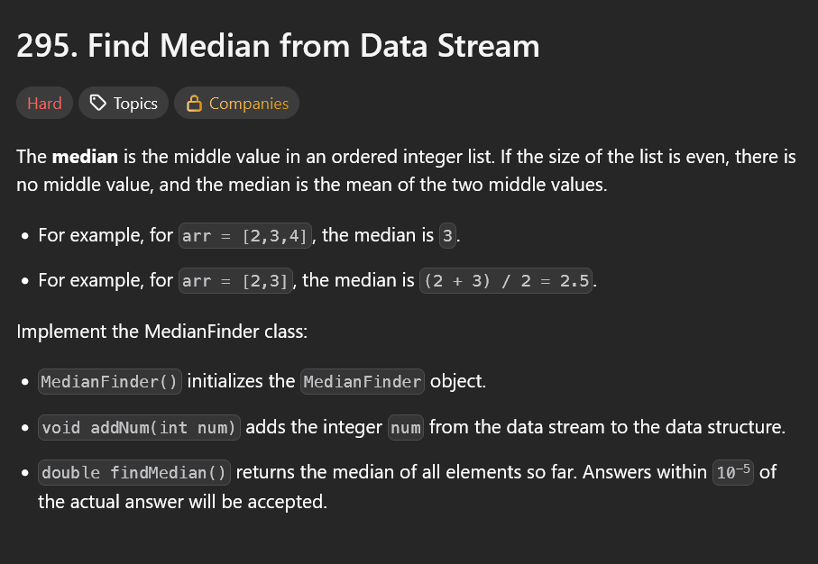
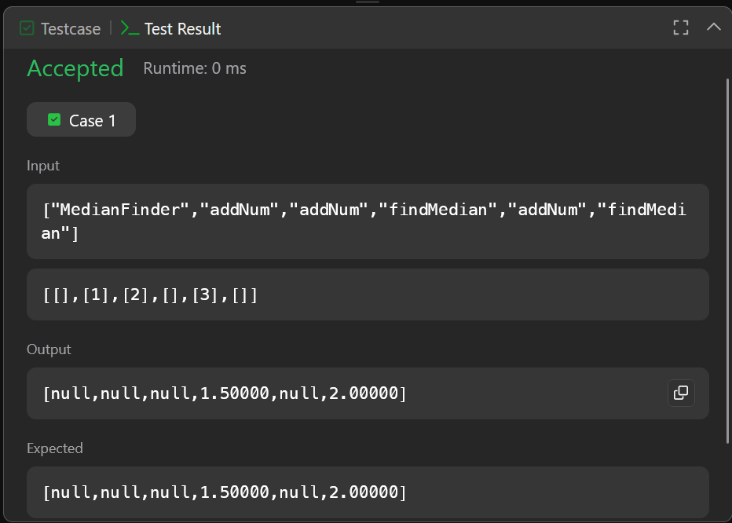

## A questão

A questão 295 pede para encontrar a mediana de um fluxo contínuo de números, ou seja, manter uma estrutura que permita adicionar valores e consultar a mediana a qualquer momento, sem precisar reordenar tudo a cada inserção.

- A mediana é o valor central de um conjunto ordenado.
- Se o tamanho for ímpar, é o valor do meio.Se for par, é a média dos dois valores centrais.

## Estratégia

A ideia foi mostrar uma solução baseada em árvore AVL, que permite tanto inserções rápidas (O(log n)) quanto buscas por posição (k-ésimo elemento) também em O(log n).

## Algoritmo utilizado

- Cada número é inserido na árvore AVL mantendo o balanceamento automático.
- Cada nó guarda, além do valor, o tamanho da subárvore e a altura, o que permite acessar diretamente o elemento de índice k.
- Para encontrar a mediana: Se o total for ímpar retorna o elemento central. Se for par faz a média dos dois centrais.

## Resultado

A solução passou nos testes, conforme atesta a imagem a seguir.

