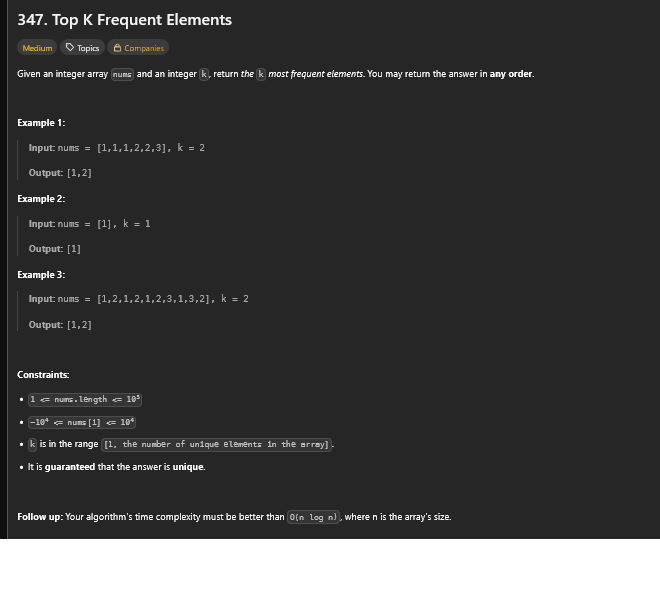
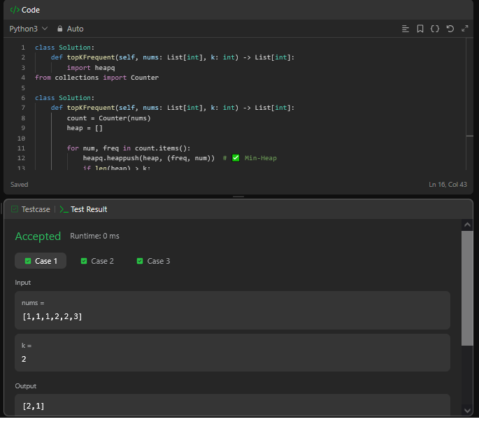

## A questão

É uma questão sobre encontrar os **k elementos mais frequentes** em um array de inteiros. A saída pode ser em qualquer ordem, desde que contenha os `k` elementos com maior frequência de ocorrência.

## Estratégia

Utilizamos uma estrutura de dados chamada **Min-Heap** para manter os `k` elementos mais frequentes de forma eficiente. A ideia principal é:

- Contar a frequência de cada número com `Counter`,
- Usar um heap de tamanho fixo `k`, onde a raiz representa o elemento menos frequente dentro dos `k` mais frequentes,
- Sempre que o heap exceder o tamanho `k`, removemos o elemento com menor frequência para garantir que apenas os `k` maiores permaneçam.

Dessa forma, conseguimos manter a complexidade melhor que `O(n log n)`, atendendo ao requisito da questão.

## Algoritmo utilizado

- Contamos a frequência de cada número com `collections.Counter`,
- Iteramos sobre os pares `(número, frequência)`:
  - Inserimos `(frequência, número)` no heap (invertendo a ordem para que o heap ordene pela frequência),
  - Se o tamanho do heap ultrapassar `k`, removemos o menor elemento (`heappop`),
- Por fim, retornamos os `k` elementos restantes no heap (que serão os `k` mais frequentes).

A estrutura de **heap mínimo** garante que o elemento com menor frequência entre os `k` mais frequentes será sempre removido primeiro.

## Resultado

A solução passou nos testes, conforme atesta a imagem a seguir.

