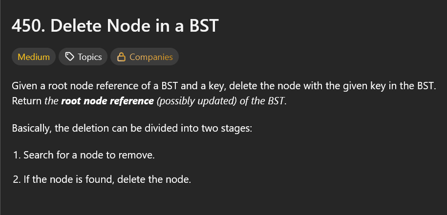
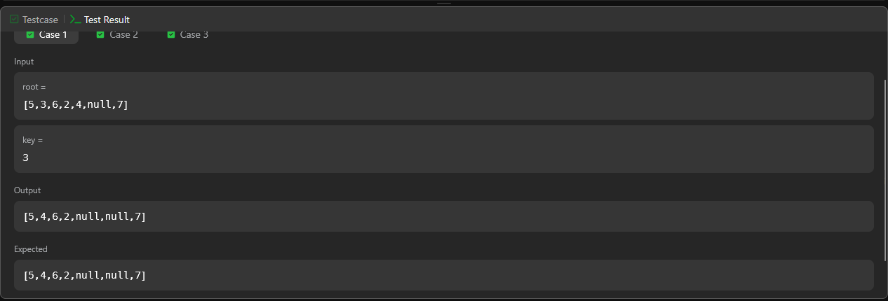
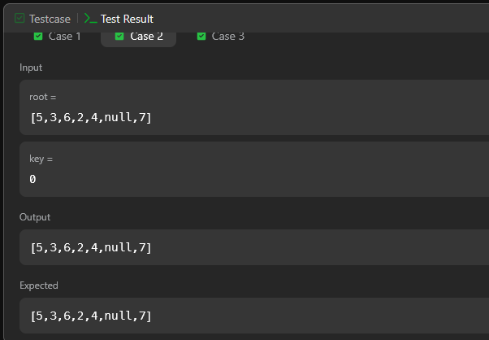
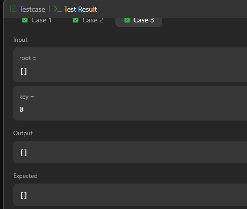

## A questão

A questão pede para remover um nó de uma árvore binária de busca (BST), mantendo sua estrutura válida.
O objetivo é retornar a nova raiz após a deleção, respeitando a propriedade fundamental da BST (todos os valores à esquerda de um nó são menores e todos os valores à direita são maiores). Além disso, quando o nó a ser removido possui dois filhos, é preciso substituí-lo pelo seu sucessor, ou seja, o menor valor da subárvore direita.

## Estratégia

A solução mais direta seria usar a remoção padrão em BST, mas para tornar a solução mais completa e eficiente, optamos por aplicar o algoritmo de remoção em uma Árvore AVL. A AVL é uma versão balanceada da BST, o que garante que a altura da árvore permaneça próxima de log(n), evitando casos degenerados onde a árvore se comporta como uma lista encadeada.

## Algoritmo utilizado

O algoritmo percorre a árvore recursivamente até encontrar o nó com o valor desejado.
Após a remoção, ele atualiza as alturas e calcula o fator de balanceamento de cada nó.
Se algum nó ficar desequilibrado, aplica uma das quatro rotações AVL (simples ou duplas) para restaurar o equilíbrio.

## Resultado

A solução passou nos testes, conforme atesta a imagem a seguir.

