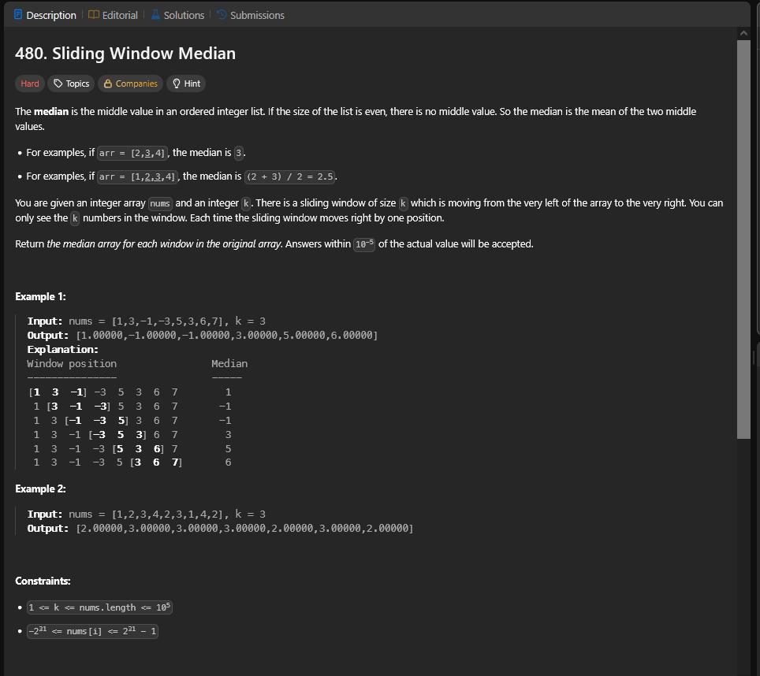
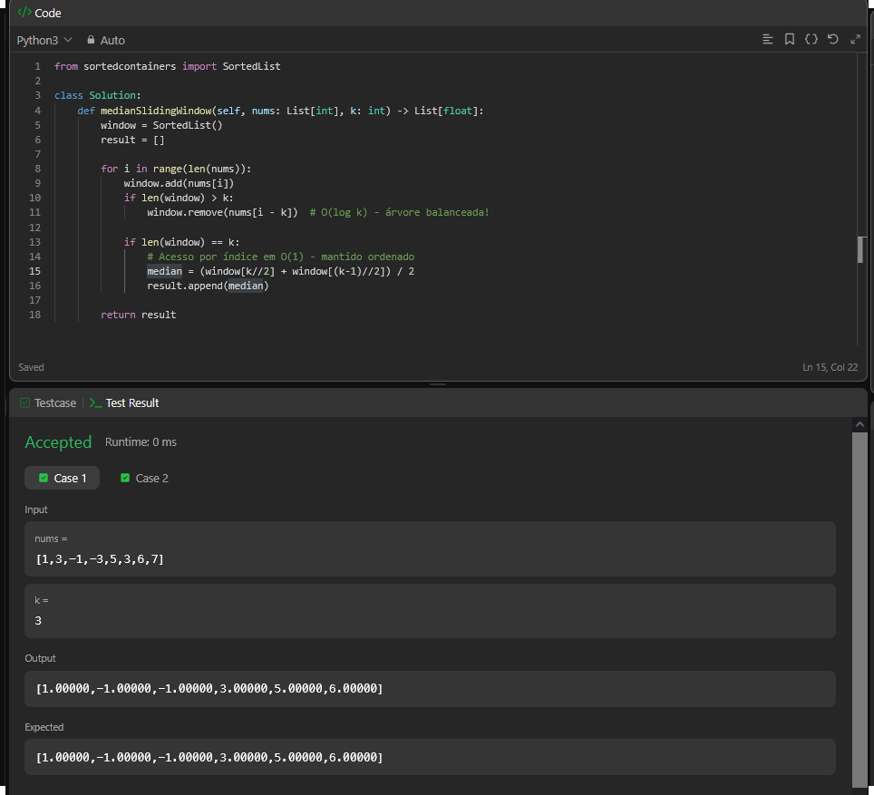

## A questão

Essa questão pede para encontrar a **mediana de uma janela deslizante** de tamanho fixo `k` sobre um array de inteiros.  
A cada passo, a janela se move uma posição para a direita, e é preciso calcular a mediana dos `k` elementos visíveis naquele momento.

---

## Estratégia

A solução usa a estrutura `SortedList` da biblioteca `sortedcontainers`, que internamente é implementada como uma **árvore B-Tree balanceada**.  
Essa estrutura mantém os elementos sempre **ordenados** e garante que todas as operações de inserção e remoção ocorram em **O(log k)**.

Com isso, conseguimos:
- Inserir e remover elementos da janela de forma eficiente;
- Acessar rapidamente os elementos centrais;
- Calcular a mediana sem precisar reordenar a janela a cada iteração.

---

## Algoritmo utilizado

- Mantemos uma `SortedList` chamada `window`, contendo os `k` elementos atuais da janela.
- Para cada elemento em `nums`:
  - Inserimos `nums[i]` na estrutura com `window.add()` — **O(log k)**;
  - Se o tamanho da janela exceder `k`, removemos `nums[i - k]` com `window.remove()` — **O(log k)**;
  - Quando a janela estiver completa (`len(window) == k`), obtemos a mediana:
    - Se `k` for ímpar: `window[k // 2]`;
    - Se `k` for par: média de `window[k // 2 - 1]` e `window[k // 2]`.

Como a `SortedList` é uma B-Tree balanceada, os elementos permanecem sempre ordenados, e o acesso ao elemento central ocorre em **O(1)**.

---

## Resultado

A solução foi aceita no LeetCode.  
O uso da `SortedList` foi essencial para manter a janela ordenada e garantir desempenho logarítmico em cada passo.

