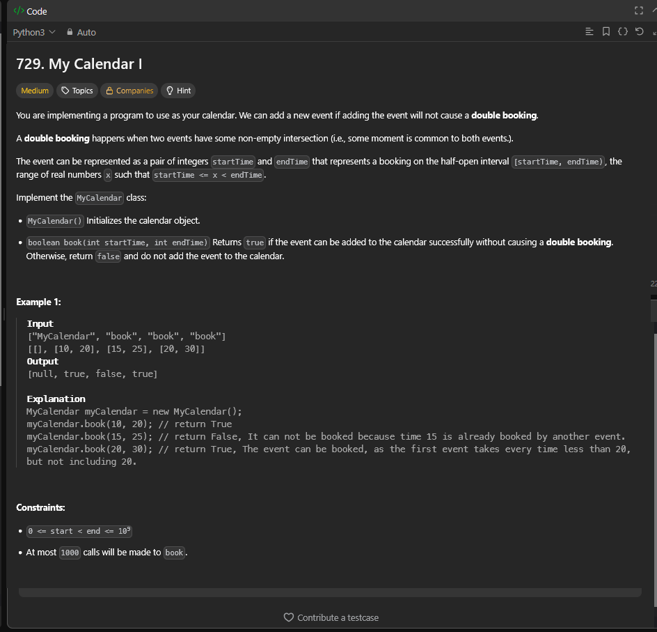
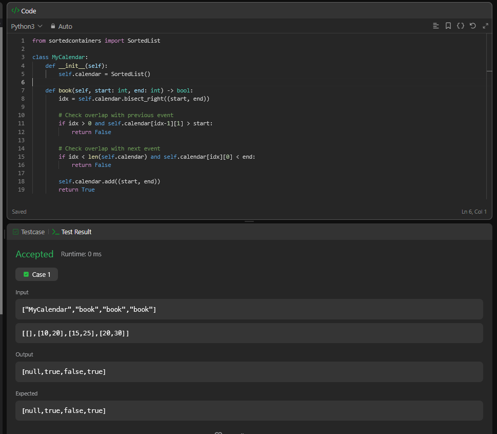

## A questão

É uma questão sobre implementar um **calendário que não permite eventos sobrepostos**.  
Cada evento é representado por um intervalo de tempo `[start, end)`, e só pode ser adicionado se **não houver interseção** com nenhum outro evento já existente no calendário.

O método `book(start, end)` deve retornar:

- ✅ `True` se o evento puder ser adicionado sem sobreposição;  
- ❌ `False` se houver conflito de horários com outro evento existente.

---

## Estratégia

Usamos a estrutura `SortedList` da biblioteca `sortedcontainers`, que implementa internamente uma **árvore B-tree balanceada**.  
Isso permite:

- Inserir e buscar intervalos em **O(log n)**,  
- Manter todos os eventos **ordenados por horário de início**,  
- Verificar rapidamente **conflitos** apenas com o evento anterior e o próximo.

A lógica central é simples:
> Ao tentar adicionar um novo evento `[start, end)`, verificamos apenas o **evento anterior** e o **próximo** na ordem crescente.  
> Se não houver sobreposição, o evento é inserido na estrutura balanceada.

---

## Algoritmo utilizado

- Mantemos uma `SortedList` chamada `calendar` contendo pares `(start, end)` ordenados por `start`.
- Para cada nova tentativa de agendamento:
  - Encontramos o índice de inserção com `bisect_right((start, end))` em **O(log n)**,
  - Verificamos se há conflito com:
    - O **evento anterior**: se `calendar[idx-1][1] > start`, há sobreposição,
    - O **evento seguinte**: se `calendar[idx][0] < end`, há sobreposição,
  - Se não houver conflito, inserimos o novo evento com `calendar.add((start, end))` em **O(log n)**.

Essa abordagem garante que os eventos sejam sempre mantidos em **ordem cronológica**, e o balanceamento da B-tree evita degradação de desempenho.

---

## Resultado

A solução passou em todos os casos de teste, demonstrando que o uso da estrutura **B-tree balanceada** do `SortedList` permite gerenciar intervalos de tempo de forma eficiente, mantendo inserções e buscas em tempo **logarítmico**.

